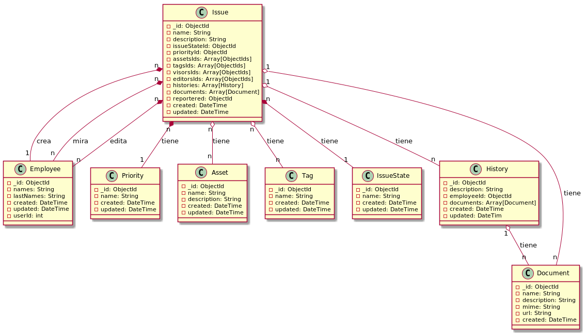

# Gestión de Ticktes - Ruby/MongoDB

- [Documentación](#documentación)

### Imágenes de PlantUML

Generar UMLs:

    $ chmod +x render_all_puml.sh
    $ ./render_all_puml.sh

---

## Documentación

Diagrama de clases

