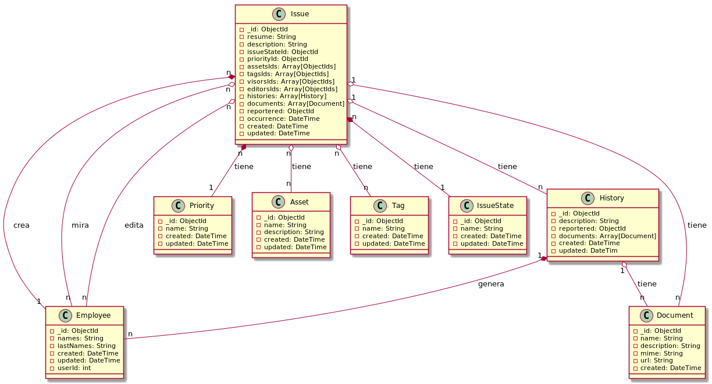

# Gestión de Ticktes - Ruby/MongoDB

- [Documentación](#documentación)

Ejecución del servidor:

    $ gem install bundler
    $ bundler install
    $ rake server:development  # Inicia el servidor en modo de desarrollo
    $ rake server:production   # Inicia el servidor en modo de producción
    $ rake test:run   

Crear backup de la base de datos MongoDB:

    $ sudo mongodump --db tickets --out db/

Restaurar backup de la base de datos MongoDB:

    $ sudo mongorestore --db tickets db/tickets

### Imágenes de PlantUML

Generar UMLs:

    $ chmod +x render_all_puml.sh
    $ ./render_all_puml.sh

---

## Documentación

Diagrama de clases

